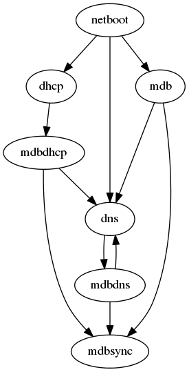

Setup instructions
==================

If you are like the typical Prologin organizer, you're probably reading this
documentation one day before the start of the event, worried about your ability
to make everything work before the contest starts. Fear not! This section of
the documentation explain everything you need to do to set up the
infrastructure for the finals, assuming all the machines are already physically
present. Just follow the guide!

Mainteners:

- Alexandre Macabies (2013, 2014)
- Antoine Pietri (2013, 2014)
- Marin Hannache (2013, 2014)
- Pierre Bourdon (2013, 2014)
- Paul Hervot (2014)
- Rémi Audebert (2014)
- Nicolas Hureau (2013)
- Pierre-Marie de Rodat (2013)
- Sylvain Laurent (2013)

Step 0: hardware and network setup
----------------------------------

Before installing servers, we need to make sure all the machines are connected
to the network properly. Here are the major points you need to be careful
about:

* Make sure to balance the number of machines connected per switch: the least
  machines connected to a switch, the better performance you'll get.
* Inter-switch connections is not very important: we tried to make most things
  local to a switch (RFS + HFS should each be local, the rest is mainly HTTP
  connections to services).
* Have a very limited trust on the hardware that is given to you, and if
  possible reset them to a factory default.

For each pair of switches, you will need one RHFS server (connected to the 2
switches via 2 separate NICs, and hosting the RFS + HFS for the machines on
these 2 switches). Please be careful out the disk space: assume that each RHFS
has about 100GB usable for HFS storage. That means at most 50 contestants (2GB
quota) or 20 organizers (5GB quota) per RHFS. With contestants that should not
be a problem, but try to balance organizers machines as much as possible.

You also need one gateway/router machine, which will have 3 different IP
addresses for the 3 logical subnets used during the finals:

:Users and services: 192.168.0.0/23
:Alien (unknown): 192.168.250.0/24
:Upstream: Based on the IP used by the bocal internet gateway.

Contestants and organizers must be on the same subnet in order for UDP
broadcasting to work between them. This is required for most video games played
during the finals: server browsers work by sending UDP broadcast announcements.

Having services and users on the same logical network avoids all the traffic
from users to services going through the gateway. Since this includes all RHFS
traffic, we need to make sure this is local to the switch and not being routed
via the gateway. However, for clarity reasons, we allocate IP addresses in the
users and services subnet like this:

:Users: 192.168.0.0 - 192.168.0.253
:Services and organizers machines: 192.168.1.0 - 192.168.1.253

Step 1: setting up the core services: MDB, DNS, DHCP
----------------------------------------------------

This is the first and trickiest part of the setup. As this is the core of the
architecture, everything kind of depends on each other:



Fortunately, we can easily work around these dependencies in the beginning.

All these core services will be running on ``gw``, the network gateway.
They could run elsewhere but we don't have a lot of free machines and the core
is easier to set up at one single place.

Basic system
~~~~~~~~~~~~

The very first step is to install an Arch Linux system. In order to do that,
use the ``install_gw.sh`` script just after booting an Arch Linux install
media::

  pacman -Sy git
  git clone http://bitbucket.org/prologin/sadm
  cd sadm/bootstrap
  # Keep an eye on the install process in case of breakage
  ./install_gw.sh
  # If the install goes without trouble the system will reboot

After the reboot, and for each new shell, activate the virtualenv::

  source /var/prologin/venv/bin/activate

Gateway network configuration
~~~~~~~~~~~~~~~~~~~~~~~~~~~~~

``gw`` has three static IPs, the first two are on the interface named ``lan``
and the last one on ``uplink``:

- 192.168.1.254/23 used to communicate with both the services and the users
- 192.168.250.254/24 used to communicate with aliens (aka. machines not in mdb)
- ?.?.?.?/? static IP given by the bocal to communicate with the bocal gateway

In order to setup the network interfaces, we use ``systemd-networkd``. The
configuration files are located in ``etc/systemd/network/``. You have to:

- For each of your NIC(s), edit the ``MACAddress`` field of the ``.link`` file.
- Set the static IP, gateway and DNS given by the bocal in ``upstream.netowrk``
  (default is to use DHCP).

For more information, see the `systemd-networkd documentation
<http://www.freedesktop.org/software/systemd/man/systemd-networkd.html>`_.

Then, install them::

  python install.py networkd resolved
  systemctl enable systemd-networkd && systemctl start systemd-networkd
  systemctl enable systemd-resolved && systemctl start systemd-resolved

At this point you should reboot and test your network configuration:

- There should be two interfaces: ``lan`` and ``uplink``.
- ``lan`` should have two IPs: ``192.168.250.254/24`` and ``192.168.1.254/23``
- ``uplink`` should be configured as you wanted.
- DNS is not working until you setup ``mdbdns``, so keep on!

mdb
~~~

We now have a basic environment to start setting up services on our gateway
server. We're going to start by installing ``mdb`` and configuring ``nginx`` as
a reverse proxy for this application.

First, we need to install ``Openresty`` which provides a version of ``nginx``
that supports lua scripting. For this step, see :ref:`openresty in the common
tasks section <common-openresty>`

Then install mdb. Fortunately, a very simple script is provided with the
application in order to setup what it requires::

  python install.py mdb
  mv /etc/nginx/nginx.conf{.new,}
  # ^ To replace the default configuration by our own.

.. note::

  You don't have to create super users for ``mdb`` or ``udb`` using the
  ``manage.py`` command. The root users you will add to ``udb`` will
  be super user and replicated to ``mdb``. If you want to modify the databases
  before that, use ``manage.py shell``.

This command installed the ``mdb`` application to ``/var/prologin/mdb`` and
installed the ``systemd`` and ``nginx`` configuration files required to run the
application.

Don't forget to change the ``secret_key`` used by Django::

  $EDITOR /etc/prologin/mdb-server.yml

.. note::

  You will see through this guide that you have to set a password or a shared
  secret for most of the services. This is a tedious tasks, but required in
  order to prevent unauthorised access to the services. One way to make the
  password managemnt easier is to clone the repository locally and set the
  shared secrets once and for all, then change all references of
  ``http://bitbucket.org/prologin/sadm`` to the url of your local respository.
  This way you will install pre-configured configuration files.

You should be able to start ``mdb`` and ``nginx`` like this::

  systemctl enable mdb && systemctl start mdb
  systemctl enable nginx && systemctl start nginx

In order to test if ``mdb`` is working properly, we need to go to query
``http://mdb/`` with a command line tool like ``curl``. However, to get DNS
working, we need ``mdbdns``, which needs ``mdbsync``, which needs ``mdb``. As a
temporary workaround, we're going to add ``mdb`` to our ``/etc/hosts`` file::

  echo '127.0.0.1 mdb' >> /etc/hosts

Now you should get an empty list when querying ``/query``::

  curl http://mdb/query
  # Should return []

Congratulations, ``mdb`` is installed and working properly!

.. note::

  nginx will log an error when attempting to connect to the upstream, this is
  normal and should only happen for the first time you connect to a service.

mdbsync
~~~~~~~

The next step now is to setup ``mdbsync``. ``mdbsync`` is a Tornado web server
used for applications that need to react on ``mdb`` updates. The DHCP and DNS
config generation scripts use it to automatically update the configuration when
``mdb`` changes. Once again, setting up ``mdbsync`` is pretty easy::

  python install.py mdbsync

  # Set the same ``shared_secret`` for ``mdbsync-pub.yml`` and ``mdbsync-sub.yml``
  $EDITOR /etc/prologin/mdbsync-pub.yml
  $EDITOR /etc/prologin/mdbsync-sub.yml

  systemctl enable mdbsync && systemctl start mdbsync
  systemctl reload nginx
  echo '127.0.0.1 mdbsync' >> /etc/hosts

To check if ``mdbsync`` is working, try to register for updates::

  python -c 'import prologin.mdbsync.client; prologin.mdbsync.client.connect().poll_updates(print)'
  # Should print {} {} and wait for updates

mdbdns
~~~~~~

``mdbdns`` gets updates from ``mdbsync`` and regenerates the DNS configuration.
Once again, an installation script is provided::

  python install.py mdbdns
  mv /etc/named.conf{.new,}
  # ^ To replace the default configuration by our own.
  touch /var/log/named.log && chown named /var/log/named.log
  systemctl enable mdbdns && systemctl start mdbdns
  systemctl enable named && systemctl start named

We now need to add a record in ``mdb`` for our current machine, ``gw``,
so that DNS configuration can be generated::

  cd /var/prologin/mdb
  python manage.py addmachine --hostname gw --mac 11:22:33:44:55:66 \
      --ip 192.168.1.254 --rfs 0 --hfs 0 --mtype service --room pasteur \
      --aliases mdb,mdbsync,ns,netboot,udb,udbsync,presencesync,ntp

.. note::

  If the gw does not have IP ``192.168.1.254``, use the following command to
  add it::

    ip link set dev <INTERACE> up
    ip addr add 192.168.1.254/23 dev <INTERFACE>

Once this is done, ``mdbdns`` should have automagically regenerated the DNS
configuration::

  host mdb.prolo 127.0.0.1
  # Should return 192.168.1.254

You can now remove the two lines related to ``mdb`` and ``mdbsync`` from your
``/etc/hosts`` file. The networkd config file we installed have already
instructed ``systemd-resolved`` that our nameserver is ``127.0.0.1``. You can
check by looking in ``/etc/resolv.conf``.

mdbdhcp
~~~~~~~

``mdbdhcp`` works just like ``mdbdns``, but for DHCP. You must edit
``dhcpd.conf`` to add an empty subnet for the IP given by the Bocal. If it is
on the same interface as 192.168.0.0/23, add it inside the ``shared-network``
``prolo-lan``, else add it to a new ``shared-network``::

  python install.py mdbdhcp
  mv /etc/dhcpd.conf{.new,}
  # ^ To replace the default configuration by our own.
  $EDITOR /etc/dhcpd.conf
  systemctl enable mdbdhcp && systemctl start mdbdhcp

The DHCP server will provide the Arch Linux install media for all the servers,
for that, download the Netboot Live System::

  wget https://releng.archlinux.org/pxeboot/ipxe.pxe -O /srv/tftp/arch.kpxe

Start the DHCP server::

  systemctl enable dhcpd4 && systemctl start dhcpd4

.. note::

  ``gw`` needs to have ``192.168.1.254/23`` as a static IP or else
  ``dhcpd`` will not satrt.

netboot
~~~~~~~

Netboot is a small HTTP service used to handle interactions with the PXE boot
script: machine registration and serving kernel files. Once again, very simple
setup::

  python install.py netboot
  systemctl enable netboot && systemctl start netboot
  systemctl reload nginx

TFTP
~~~~

The TFTP server is used by the PXE clients to fetch the first stage of the boot
chain: the iPXE binary (more on that in the next section). We simply setup
``tftp-hpa``::

  systemctl enable tftpd.socket && systemctl start tftpd.socket

The TFTP server will serve files from ``/srv/tftp``.

iPXE bootrom
~~~~~~~~~~~~

The iPXE bootrom is an integral part of the boot chain for user machines. It is
loaded by the machine BIOS via PXE and is responsible for booting the Linux
kernel using the nearest RFS. It also handles registering the machine in the
MDB if needed. These instructions need to be run on ``gw``.

We need a special version of iPXE supporting the LLDP protocol to speed up
machine registration.

iPXE is an external open source project, clone it first::

  git clone git://git.ipxe.org/people/mareo/ipxe.git

Swith to the ``lldp`` branch::

  cd ipxe
  git checkout lldp

Then compile time settings need to be modified. Add the following lines::

  // in src/config/local/general.h
  #define REBOOT_CMD
  #define PING_CMD
  #define NET_PROTO_LLDP

You should then edit ``/root/sadm/python-lib/prologin/netboot/script.ipxe`` to
add the switches.

You can now build iPXE: go to ``src/`` and build the bootrom, embedding our
script::

  cd src/
  make bin/undionly.kpxe EMBED=/root/sadm/python-lib/prologin/netboot/script.ipxe
  cp bin/undionly.kpxe /srv/tftp/prologin.kpxe

udb
~~~

Install ``udb`` using the ``install.py`` recipe::

  python install.py udb

Don't forget to change the ``secret_key`` used by Django::

  $EDITOR /etc/prologin/mdb-server.yml

Enable the service::

  systemctl enable udb && systemctl start udb
  systemctl reload nginx

You can then import all contestants information to ``udb`` using the
``batchimport`` command::

  cd /var/prologin/udb
  python manage.py batchimport --file=/root/finalistes.txt

The password sheet data can then be generated with this command, then printed
by someone else::

  python manage.py pwdsheetdata --type=user > /root/user_pwdsheet_data

Then do the same for organizers::

  python manage.py batchimport --logins --type=orga --pwdlen=10 \
      --uidbase=11000 --file=/root/orgas.txt
  python manage.py pwdsheetdata --type=orga > /root/orga_pwdsheet_data

Then for roots::

  python manage.py batchimport --logins --type=root --pwdlen=10 \
      --uidbase=12000 --file=/root/roots.txt
  python manage.py pwdsheetdata --type=root > /root/root_pwdsheet_data

udbsync
~~~~~~~

usbsync is a server that pushes updates of the user list.

Again, use the ``install.py`` recipe::

  python install.py udbsync

  # Edit the shared secret
  $EDITOR /etc/prologin/udbsync-sub.yml
  $EDITOR /etc/prologin/udbsync-pub.yml

  systemctl enable udbsync && systemctl start udbsync
  systemctl reload nginx

We can then configure udbsync clients::

  python install.py udbsync_django udbsync_rootssh
  systemctl enable udbsync_django@mdb && systemctl start udbsync_django@mdb
  systemctl enable udbsync_django@udb && systemctl start udbsync_django@udb
  systemctl enable udbsync_rootssh && systemctl start udbsync_rootssh

.. note::

  Adding all the users to the sqlite databases is slow will lock them. You will
  have to wait a bit for ``mdb`` and ``udb`` to sync their user databases.

presencesync
~~~~~~~~~~~~

Presencesync manages the list of logged users.

Once again::

  python install.py presencesync

  # Edit the shared secret
  $EDITOR /etc/prologin/presencesync-sub.yml
  $EDITOR /etc/prologin/presencesync-pub.yml

  systemctl enable presencesync && systemctl start presencesync
  systemctl reload nginx

iptables
~~~~~~~~

.. note::

    If the upstream of ``gw`` is on a separate NIC you should replace
    etc/iptables with etc/iptables_upstream_nic.save

The name of the interface is hardcoded in the iptables configuration, you
must edit it to match your setup::

  $EDITOR etc/iptables.save

Setup the iptables rules and ipset creation for users allowed internet acces::

  python install.py firewall
  systemctl enable firewall && systemctl start firewall

And the service that updates these rules::

  python install.py presencesync_firewall
  systemctl enable presencesync_firewall && systemctl start presencesync_firewall

Step 2: file storage
--------------------

.. sidebar:: rhfs naming scheme

    A rhfs has two NIC and is connected to two switches, there is therefore two
    ``hfs-server`` running on one rhfs machine, each with a different id. The
    hostname of the rhfs that hosts hfs ``0`` and hfs ``1`` will have the
    following hostname: ``rhfs01``.


The ``rfs/install.sh`` script will configure a rhfs automatically. You should
edit it to set the ``root`` password.

In order to add a rhfs, ``rhfs01`` for example, follow this procedure:

#. Boot the machine using PXE and register it into ``mdb`` as ``rhfs01``.
#. Go to ``mdb/`` and add aliases for the NIC you just registered:
   ``rhfs,rhfs0,hfs0,rfs0``. Also add another machine : ``rhfs1`` with the MAC
   address of the second NIC in the rhfs, it shoud have the following aliases:
   ``hfs1,rfs1``.
#. Reboot the machine and boot an Arch Linux install media.
#. Download ``rfs/install.sh`` and run it.
#. Reboot

Step 3: booting the user machines
---------------------------------

Note: if you are good at typing on two keyboards at once, or you have a spare
root doing nothing, this step can be done in parallel with step 4.

Installing the RHFS
~~~~~~~~~~~~~~~~~~~

.. _ArchLinux Diskless Installation: https://wiki.archlinux.org/index.php/Diskless_network_boot_NFS_root#Bootstrapping_installation

The basic install process is already documented through the
`ArchLinux Diskless Installation`_. For conveniance, use::

  # Install the udbsync clients for rhfs
  python install.py udbsync_rfs
  # Edit the shared-secret to match the one on gw
  $EDITOR /etc/prologin/udbsync-sub.yml
  # Edit the root password of the users machines
  $EDITOR rfs/rfs.sh
  # Setup the rhfs server, install the exported rootfs
  python install.py rfs
  # Edit all the shared-secrets:
  $EDITOR /export/nfsroot/etc/prologin/*.yml

The installation script will bootstrap a basic archlinux system in
``/export/nfsroot`` with a few packages, a prologin hook that creates tmpfs at
``/var/{log,tmp,spool/mail}``, libprologin and some sadm services
(udbsync_passwd, udbsync_rootssh and presenced)

You should then install some useful packages for the contestants (see
``rfs/contestants_package_list`` file).

To install a new package (*never* use arch-chroot on a live nfs export)::

  pacman --root /export/nfsroot -Sy package

TODO: How to sync, hook to generate /var...

Copy the the kernel and initramfs from ``rhfs``::

  scp rhfs:/export/nfsroot/boot/vmlinuz-linux /srv/tftp/kernel
  scp rhfs:/export/nfsroot/boot/initramfs-linux.img /srv/tftp/initrd

Setting up hfs
~~~~~~~~~~~~~~

First, setup postgresql on ``web``. It is used by all the hfs.

.. note::

  If you just want to test the ``hfs`` and have not yet setup ``web``, install
  the database on ``gw`` and add ``db`` to the list of aliases of ``gw``.

  The database should be on ``web`` because most of its consumers are
  webservices: redmine, concours, masterworker, etc.

Setup postgresql
````````````````

Create a new database::

  su - postgres -c "initdb --locale en_US.UTF-8 -D '/var/lib/postgres/data'"

Edit and uncomment ``/var/lib/postgres/data/postgresql.conf`` to make
postgresql listen on every interface::

  listen_addresses = '*'

And edit ``/var/lib/postgres/data/pg_hba.conf`` in order to allow all users
to connect with password::

  host     all             all             192.168.1.0/24           password

Then start postgresql::

  systemctl enable postgresql && systemctl start postgresql

Create user ``hfs``, database ``hfs``, and associated tables:

.. note::

    You must change the password of user ``hfs`` in ``sql/hfs.sql`` to match
    the one in ``etc/prologin/hfs-server.yml``.

Create the database::

  su - postgres -c "psql" < ./sql/hfs.sql

Start the hfs
~~~~~~~~~~~~~

On every ``rhfs`` machine, install the hfs server::

  python install.py hfs
  # Set the postgresql password
  $EDITOR /etc/prologin/hfs-server.yml
  # Change HFS_ID to what you need
  systemctl enable hfs@HFS_ID && systemctl start hfs@HFS_ID

Then, setup the skeleton of a user home:

  cp -r STECHEC_BUILD_DIR/home_env /export/skeleton

Test procedure:

#. Boot a user machine
#. Log using a test account (create one if needed), a hfs should be created
   with the skeleton in it.
#. The desktop launches, the user can edit files and start programs
#. Close the session
#. Boot a user machine using an other hfs
#. Log using the same test account, the hfs should be be migrated.
#. The same desktop launches with modifications.

Forwarding of authorized_keys
~~~~~~~~~~~~~~~~~~~~~~~~~~~~~

On a rhfs, the service ``udbsync_rootssh`` (aka. ``udbsync_clients.rootssh``)
writes the ssh public keys of roots to ``/root/.ssh/authorized_keys``. The unit
``rootssh.path`` watches this file, and on change starts the service
``rootssh-copy`` that updates the ``authorized_keys`` in the
``/exports/nfsroot``.

Step 4: Concours
----------------

Setup web
~~~~~~~~~

The web services will usually be set up on a separate machine from the ``gw``,
for availability and performance reasons (all services on ``gw`` are critical,
so you wouldn't want to mount a NFS on it for example). This machine is named
``web.prolo``.

Once again, register a server on mdb and set up a standard Arch system. Add the
following alliases on ``mdb`` ::

  db,concours,wiki,bugs,redmine,docs,home,paste,map,masternode

You will want to ssh at this machine, so enable ``udbync_rootssh``::

  python install.py udbsync_rootssh
  $EDITOR /etc/prologin/udbsync-sub.yml
  systemctl enable udbsync_rootssh && systemctl start udbsync_rootssh

We'll now compile our custom version of openresty. For this step, see
:ref:`openresty in the common tasks section <common-openresty>`

Then, install the ``nginx`` configuration from the repository::

  python install.py nginxcfg
  mv /etc/nginx/nginx.conf{.new,}
  systemctl enable nginx && systemctl start nginx

concours
~~~~~~~~

.. note::

    Concours is a *contest* service. It won't be enabled by default.
    See :ref:`enable_contest_services`.

Setup the database::

  # Change the password
  $EDITOR ./sql/concours.sql
  su - postgres -c "psql" < ./sql/concours.sql

Install it::

  # Edit the configuration file first, because the install procedure uses it
  $EDITOR etc/prologin/concours.yml
  python install.py concours
  # Edit the shared secret
  $EDITOR /etc/prologin/udbsync-sub.yml
  systemctl enable concours && systemctl start concours
  systemctl enable udbsync_django@concours && systemctl start udbsync_django@concours
  systemctl reload nginx

Step 5: Setting up masternode and workernode
--------------------------------------------

On ``masternode``::

  python install.py masternode
  # Edit the passwords
  $EDITOR /etc/prologin/masternode.yml
  systemctl enable masternode && systemctl start masternode

On another machine (because ``makepkg`` won't let you build packages as
``root``), build ``stechec2`` and ``stechec2-makefiles``::

  git clone https://bitbucket.org/prologin/stechec2
  cd stechec2/pkg/stechec2
  makepkg
  scp stechec2-prologin2015-1-x86_64.pkg.tar.xz rhfs:
  cd ../stechec2-makefiles
  makepkg
  scp stechec2-makefiles-prologin2015-1-any.pkg.tar.xz rhfs:

Then copy the packages onto ``rhfs``, and install them in the exported
``nfsroot``. They will be used by workernode to compile the champions.

::

  pacman -U stechec2-prologin2015-1-x86_64.pkg.tar.xz -r /export/nfsroot
  pacman -U stechec2-makefiles-prologin2015-1-any.pkg.tar.xz -r /export/nfsroot

Then, still for the users machines, install ``workernode``::

  arch-chroot /export/nfsroot/
  cd sadm
  python install.py workernode
  cp python-lib/prologin/workernode/compile-champion.sh /usr/bin/compile-champion.sh
  $EDITOR /etc/prologin/workernode.yml
  systemctl enable workernode
  exit # get out of the chroot

You may now reboot a user machine and check that the service is started and
that the worker is registered to the master.

You should now be able to upload matches to ``concours/`` (you have to enable
it see , see :ref:`enable_contest_services`), see them dispatched by
``masternode`` to ``workernode`` s and get the result.

Step 6: Switching to contest mode
---------------------------------

Block internet access
~~~~~~~~~~~~~~~~~~~~~

Edit ``/etc/prologin/presencesync_firewall.yml`` and remove the ``user`` group,
the restart ``presencesync_firewall``.

.. _enable_contest_services:

Enable contest services
~~~~~~~~~~~~~~~~~~~~~~~

By default, most of the web services are hidden from the contestants. In order
to show them, you must activate the "contest mode" in some service.

Edit ``/etc/nginx/nginx.conf``, uncomment the following line::

  # include services_contest/*.nginx;

Enable Single Sign-On
~~~~~~~~~~~~~~~~~~~~~

By default, SSO is disabled as it requires other dependencies to be up and
running.

Edit ``/etc/nginx/nginx.conf``, uncomment the following lines::

  # lua_package_path '/etc/nginx/sso/?.lua;;';
  # init_by_lua_file sso/init.lua;
  # access_by_lua_file sso/access.lua;

Test the contest
~~~~~~~~~~~~~~~~

TODO

Reset the hfs
~~~~~~~~~~~~~

If you need to delete every ``/home`` created by the hfs, simply delete all nbd
files in ``/export/hfs/`` and delete entries in the ``user_location`` table of
the hfs' database::

  # For each hfs instance
  rm /export/hfs/*.nbd

  echo 'delete from user_location;' | su - postgres -c 'psql hfs'

Common tasks
------------

.. _common-openresty:

Openresty
~~~~~~~~~

Openresty, a nginx extension with lua scripting. This is primarily used for
Single Sign-On (SSO). Because ``makepkg`` won't let you build packages as root,
you either have to create a new user or build the package on another machine and
then transfer it over.

Build the package::

  cd pkg/openresty
  make all

You should get a tarball named like ``openresty-version.pkg.tar.xz``. Proceed
to its installation on the target machine::

  pacman -U openresty-*.pkg.tar.xz

.. note::

    This package is a drop-in replacement for nginx. Even though the package
    is called ``openresty``, all paths and configuration files are the same
    as the official ``nginx`` package, so you should be able to switch between
    the two without changing anything.
